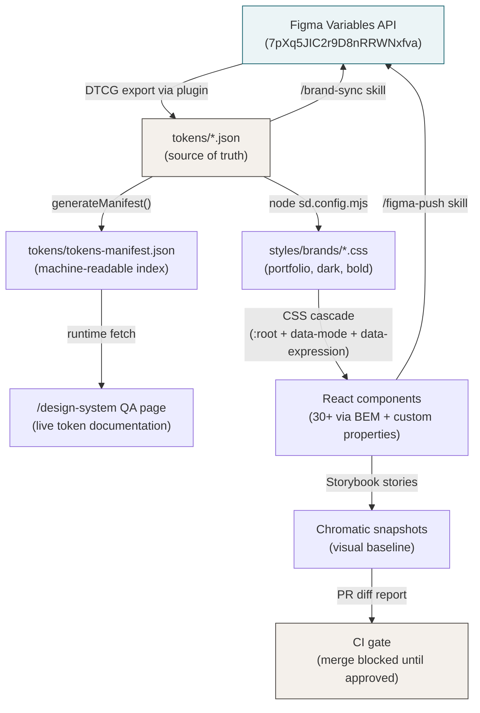
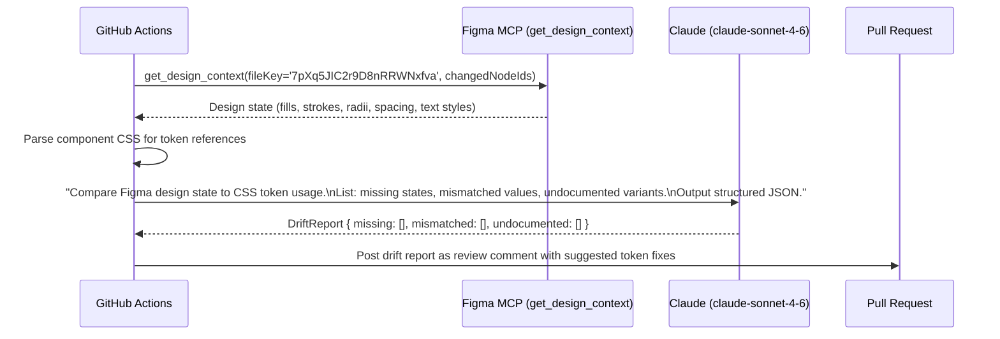
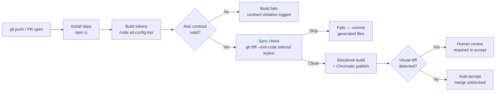
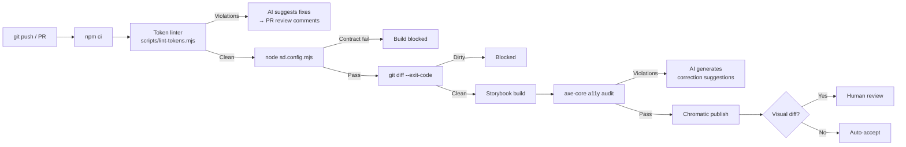
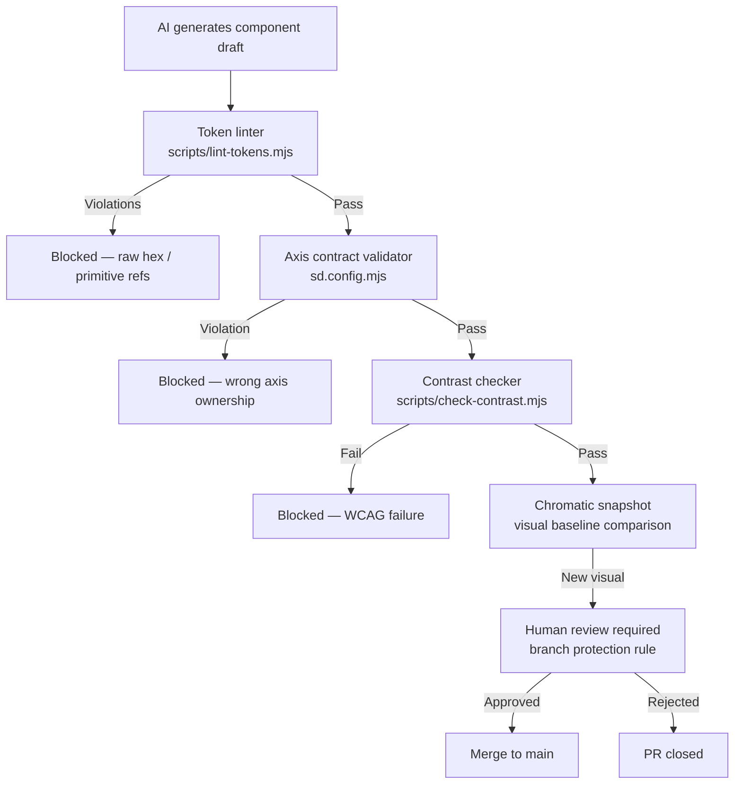

# Autonomous Design System: Architecture for Scaling amezquita.dk

*A strategic and technical evaluation of where this system is, where it can go, and how AI fits in as an active contributor — not a headline feature.*

> **Status: Largely implemented — July 2026.**
> The deterministic governance layer described in Pillar 3 is built and running in CI. The remaining work is the agent loops (Pillar 2's drift detection and doc automation). Where this document's code sketches differ from the shipped scripts, the shipped scripts are authoritative.
>
> | Area | Status | Where |
> |---|---|---|
> | Token linter (6 rules + suppressions; colour/motion/primitive/BEM-depth/reduced-motion rules cover app/, styles/, portfolio/ too) | ✅ In CI | `scripts/lint-tokens.mjs` |
> | Contrast governance (4 modes incl. dark+bold) | ✅ In CI | `scripts/check-contrast.mjs` + `tokens/contrast-pairs.json` |
> | Dependency graph | ✅ In CI | `scripts/build-dependency-graph.mjs` → `tokens/dependency-graph.json` |
> | DTCG migration | ✅ Done | `scripts/migrate-to-dtcg.mjs` (`$value`/`$type` throughout) |
> | Accessibility audit (axe on all rendered stories, incl. dark mode) | ✅ In CI | Storybook test-runner + `@storybook/addon-a11y` (`npm run a11y:stories`) |
> | Component-doc + story coverage checks (+ portfolio-tier exemption registry, dark-story requirement) | ✅ In CI | `scripts/check-components-doc.mjs`, `check-stories.mjs` |
> | Changelog bot | ✅ In CI | `scripts/build-changelog.mjs` + `update-changelog` job |
> | Figma drift detection | ✅ Script | `scripts/figma-status.mjs` vs `figma/sync-state.json` |
> | PR conformance review (agent) | ✅ Local skill | `/pr-review` — prose-rule review on top of the reporters |
> | Scheduled drift watcher | ✅ In CI | `.github/workflows/figma-drift.yml` (weekly issue) |
> | Doc-freshness agent, Chromatic triage | ⏳ Proposed | Deferred — see Pillars 2 and 3 |

---

## Current system snapshot

Before defining where to go, it's worth being precise about where the system already is. Most "design system scaling" guides assume you're starting from CSS variables in a single file. This system is not that.

**What's already in place:**

| Layer | Implementation | Files |
|---|---|---|
| Primitive tokens | Flat JSON, raw values only | `tokens/global.json` |
| Semantic tokens | Alias references to primitives | `tokens/brands/portfolio/tokens.json` |
| Axis overrides | Mode (dark) + Expression (bold) | `tokens/brands/dark/tokens.json`, `tokens/brands/bold/tokens.json` |
| Component tokens | Alias references to semantic layer | `tokens/components/*.json` (22 files) |
| CSS compilation | Style Dictionary 5, three outputs | `sd.config.mjs` → `styles/brands/*.css` |
| Axis enforcement | Build-time contract validation | `validateTokenContract()` in `sd.config.mjs` |
| Visual regression | Chromatic snapshot comparison | `.github/workflows/chromatic.yml` |
| Sync enforcement | `git diff --exit-code` on compiled artifacts | `chromatic.yml` CI step |
| Design QA page | Machine-readable token manifest | `tokens/tokens-manifest.json` → `/design-system` |
| Figma sync | Bidirectional via MCP skills | `/brand-sync`, `/figma-push` |

The architecture is genuinely ahead of most production design systems. The gaps are in four specific areas: token schema portability, AI-assisted drift detection, automated accessibility governance, and autonomous scaling paths for new themes.

---

## Pillar 1 — Single Source of Truth & Interconnected Architecture

### The reference resolution chain

Every visual value in the system traces back through an unbroken chain of references. Breaking that chain is what causes design system rot. The current chain for a button's hover color:

```
Button.css
  → var(--button-primary-background-hover)
    → tokens/components/button.json: { "value": "{color-accent-hover}" }
      → tokens/brands/portfolio/tokens.json: { "value": "{color-neutral-900}" }
        → tokens/brands/portfolio/tokens.json: { "value": "{color.warm-900}" }
          → tokens/global.json: { "value": "#1C1917" }
```

Every link in this chain is enforced — Style Dictionary throws on unresolved references, and the CI `git diff` check ensures compiled CSS always reflects the source JSON. The chain is sound.

### Gap: W3C DTCG schema non-compliance

The current token format uses a flat custom schema:

```json
{ "button-primary-background": { "value": "{color-accent-default}" } }
```

The W3C Design Tokens Community Group (DTCG) specification requires:

```json
{
  "button": {
    "primary": {
      "background": {
        "$value": "{color.accent.default}",
        "$type": "color",
        "$description": "Primary button fill — resolves to semantic accent token"
      }
    }
  }
}
```

**Why this matters for this system specifically:**

- The Figma Variables API — used by the `/brand-sync` skill — can auto-infer variable types from `$type` annotations. Without `$type`, type mapping is done manually in the skill implementation. This is the current setup and it works, but it breaks if Figma changes its type inference.
- Style Dictionary 5 supports both formats via the `usesDtcg: true` flag. Enabling it is a one-line config change.
- Any future tool in the pipeline (Token Studio, Supernova, or a custom Figma plugin) consumes DTCG natively.

**Migration path — non-breaking:**

```javascript
// scripts/migrate-to-dtcg.mjs
// One-time transform: flat keys to nested $value/$type objects

import { readFileSync, writeFileSync } from 'fs'

const TYPE_MAP = {
  'color-': 'color',
  'space-': 'dimension',
  'font-size-': 'dimension',
  'font-weight-': 'fontWeight',
  'duration-': 'duration',
  'border-radius-': 'dimension',
}

function inferType(key) {
  return Object.entries(TYPE_MAP).find(([prefix]) => key.startsWith(prefix))?.[1] ?? 'other'
}

function flatToDTCG(flat) {
  const result = {}
  for (const [key, token] of Object.entries(flat)) {
    const parts = key.split('-')
    let node = result
    for (let i = 0; i < parts.length - 1; i++) {
      node[parts[i]] = node[parts[i]] ?? {}
      node = node[parts[i]]
    }
    node[parts.at(-1)] = {
      $value: token.value,
      $type: inferType(key),
    }
  }
  return result
}
```

After running: set `usesDtcg: true` in `sd.config.mjs`. Style Dictionary resolves both `value` and `$value` so downstream builds continue without change. The axis contract validator needs its `Object.keys()` call updated to walk the nested structure recursively — a 10-line change.

### Dependency metadata: the `$extensions` layer

To support AI-assisted governance (Pillar 3), tokens need machine-readable dependency graphs. Add to the semantic layer:

```json
{
  "color": {
    "accent": {
      "default": {
        "$value": "{color.neutral.800}",
        "$type": "color",
        "$extensions": {
          "amezquita.dk": {
            "axis": "mode",
            "usedBy": [
              "button-primary-background",
              "button-secondary-border",
              "color-accent-hover"
            ],
            "wcagRole": "interactive",
            "contrastPair": "color.accent.foreground"
          }
        }
      }
    }
  }
}
```

The `usedBy` array is the dependency graph. When an AI agent changes `color.accent.default`, it can immediately know every downstream token and component affected. The `contrastPair` field enables automated WCAG checking on every token change without scanning component CSS.

### The four-layer synchronization loop



The loop is intentional. Code writes back to Figma via the push skills — the system is bidirectional. The `tokens-manifest.json` intermediate representation is the key architectural decision: it decouples the QA page from Style Dictionary internals and makes the full token graph machine-readable without parsing CSS.

---

## Pillar 2 — AI as Active Contributor & Self-Learning Engine

### The contribution boundary

Before defining what AI can do, define what it cannot do. The system's quality comes from intentional decisions. AI's role is to detect drift from those decisions and make corrections easier — not to make design decisions autonomously.

| AI can do | AI cannot do |
|---|---|
| Detect undocumented UI patterns | Create new components without human review |
| Propose token corrections as PR suggestions | Commit directly to `main` or any branch |
| Draft documentation updates | Approve or merge PRs |
| Generate contrast-passing token alternatives | Modify the axis contract in `sd.config.mjs` |
| Identify missing story states | Delete or rename existing token keys |
| Write release notes from token diffs | Create new design axes |

### Drift detection: Figma → code

The Chromatic workflow detects *visual* changes after the fact. This workflow detects *design intent* mismatches *before* a PR merges.

**Trigger:** A PR is opened or updated that modifies any file in `components/` or `tokens/`.

**Workflow:**



**What the LLM prompt looks like:**

```
You are reviewing a design-code drift report for the amezquita.dk design system.

The token convention is {category}-{property}-{variant}-{state} in kebab-case.
All component CSS must reference semantic tokens only (e.g. var(--color-text-primary)), 
never primitive tokens (e.g. var(--color-warm-900)) or raw hex values.

Figma node state for Button/Primary:
- fill: #292524 (maps to color-neutral-800 → color-accent-default ✓)
- border-radius: 9999px (maps to border-radius-full → button-border-radius ✓)
- hover fill: #1C1917 (maps to color-neutral-900 → color-accent-hover ✓)
- focus ring: missing in Figma — component has focus state in CSS

Diff from PR (Button.css):
+ .button:focus-visible { outline: 2px solid var(--color-border-focus); }
- .button--disabled { opacity: 0.4; }
+ .button--disabled { opacity: var(--opacity-disabled); }

Report any drift. Use this JSON schema:
{ "missing": [{ "location": "figma|code", "description": "..." }],
  "mismatched": [{ "token": "...", "figmaValue": "...", "codeValue": "..." }],
  "undocumented": [{ "variant": "...", "description": "..." }] }
```

### Undocumented pattern detection

Components that share nearly identical token usage sets are candidates for extraction. This runs as a scheduled weekly job, not on every PR.

```javascript
// scripts/detect-patterns.mjs

import { glob } from 'glob'
import { readFileSync } from 'fs'

const cssFiles = await glob('components/**/*.css')

// Extract all var(--token-name) references per file
const tokenUsageMap = cssFiles.map(file => ({
  file,
  tokens: new Set([...readFileSync(file, 'utf8').matchAll(/var\(--([^)]+)\)/g)].map(m => m[1]))
}))

// Jaccard similarity — files sharing >80% of tokens are pattern candidates
const candidates = []
for (let i = 0; i < tokenUsageMap.length; i++) {
  for (let j = i + 1; j < tokenUsageMap.length; j++) {
    const a = tokenUsageMap[i].tokens
    const b = tokenUsageMap[j].tokens
    const intersection = new Set([...a].filter(t => b.has(t)))
    const union = new Set([...a, ...b])
    const similarity = intersection.size / union.size
    if (similarity > 0.8) {
      candidates.push({ files: [tokenUsageMap[i].file, tokenUsageMap[j].file], similarity })
    }
  }
}

// Pass candidates to Claude for naming and description
```

The LLM receives the candidate pairs and the token lists, then suggests whether the overlap represents a genuine shared component or coincidental similarity. Output is a GitHub issue, not a PR.

### Documentation automation on token changes

When any `tokens/components/*.json` file is modified in a PR:

1. CI extracts changed token keys and values
2. Reads the component's existing Storybook story descriptions
3. Passes both to Claude with context from `design.md`
4. Claude generates a draft `docs` string for the story's `parameters.docs.description`
5. Draft is attached to the PR as a commit suggestion — human accepts or edits

**Release notes from token diffs:**

`tokens-manifest.json` is already versioned in git. A CI step diffs the current branch manifest against `main` and formats it as structured JSON — changed tokens, new tokens, removed tokens. Claude then writes a CHANGELOG entry:

```
Input:
{ 
  changed: [{ token: "color-accent-default", from: "#292524", to: "#15616D" }],
  axis: "expression/bold" 
}

Output (in Antonio's voice):
"Bold expression: accent color updated from warm charcoal (#292524) to teal (#15616D). 
All button primary, secondary border, and accent text states update automatically — 
no component changes required."
```

---

## Pillar 3 — Automated Governance, QA & Error Correction

### Current CI pipeline



The three additions this section originally proposed — a token linter before the SD build, an accessibility audit after the Storybook build, and a correction step triggered by failures — are now built. The linter and audit run in `chromatic.yml`; the correction step runs as the local `/pr-review` skill (agent interprets the reporters' JSON output, human applies).

### Extended pipeline



### Token linter implementation

```javascript
// scripts/lint-tokens.mjs
import { glob } from 'glob'
import { readFileSync, writeFileSync } from 'fs'

const componentCSS = await glob('components/**/*.css')
const violations = []

const RULES = [
  {
    name: 'no-raw-hex',
    pattern: /#[0-9A-Fa-f]{3,8}\b/g,
    message: 'Raw hex value — use a semantic token instead',
  },
  {
    name: 'no-primitive-tokens',
    // Primitive tokens: --color-warm-*, --color-black, --color-white, --color-teal-*
    pattern: /var\(--color-(warm|black|white|teal)[-\d]*\)/g,
    message: 'Primitive token reference in component CSS — use --color-text-*, --color-surface-*, or --color-accent-* instead',
  },
  {
    name: 'no-hardcoded-motion',
    // Match timing values not immediately followed by a comment marking them as intentional
    pattern: /\b\d+(?:\.\d+)?ms\b(?!\s*\/\*\s*intentional)/g,
    message: 'Hardcoded timing value — use --duration-* token instead',
  },
  {
    name: 'no-hardcoded-spacing',
    // px values in component CSS that aren't 0, 1px, or 2px (border widths)
    pattern: /(?<![0-9])[3-9]\d*px|[1-9]\d{2,}px/g,
    message: 'Hardcoded spacing value — use --space-* token instead',
  },
]

for (const file of componentCSS) {
  const content = readFileSync(file, 'utf8')
  for (const rule of RULES) {
    const matches = [...content.matchAll(rule.pattern)].map(m => m[0])
    if (matches.length) {
      violations.push({ file, rule: rule.name, message: rule.message, found: matches })
    }
  }
}

if (violations.length) {
  writeFileSync('token-violations.json', JSON.stringify(violations, null, 2))
  console.error(`Token linter found ${violations.length} violation(s). See token-violations.json`)
  process.exit(1)
}

console.log('✓ Token linter passed')
```

When violations are found, a CI step reads `token-violations.json` and the affected component files, passes both to Claude, and posts the corrections as GitHub review `suggestion` blocks — not direct commits.

### Accessibility enforcement — as built (July 2026)

CI builds Storybook once and runs the Storybook test-runner against it in real Chromium (`npm run a11y:stories` in `chromatic.yml`; the same build is handed to Chromatic via `storybookBuildDir`). The a11y addon is configured with `a11y: { test: 'error' }` in `.storybook/preview.tsx`, so **any** axe violation on **any** rendered story fails the build — structural rules and rendered contrast alike. Coverage scales automatically with story coverage; there is no fixture or story allowlist to maintain.

This replaced an earlier JSDOM-fixture audit (`scripts/run-a11y-audit.mjs`, deleted) that covered 4 hand-written HTML fixtures. On its first full run the rendered audit found 17 violations the fixtures could never see — including a build-level bug where component tokens baked in light-mode values inside nested dark scopes (fixed in `sd.config.mjs` via `preserveSemanticRefs` + axis diff emission).

**Hard constraint:** No accessibility fix is auto-committed. The risk of a `suggestion` that satisfies axe-core but degrades real-world assistive technology behavior is too high. Human approval is required.

### Contrast governance on token changes — as built

`scripts/check-contrast.mjs` runs in CI on every push and PR. It reads a standalone pair manifest, `tokens/contrast-pairs.json`, and validates every pair across all four mode×expression combinations — light, dark, bold, and darkBold (the merged cascade where bold overrides win over dark; the combination the July 2026 audit found failing at 2.46:1).

```json
// tokens/contrast-pairs.json — one entry per enforced pair
{
  "bg": "color-surface-secondary",
  "fg": "color-text-secondary",
  "role": "secondary-text-on-secondary-surface",
  "minRatio": 4.5
}
```

The original proposal here was an inline `$extensions.amezquita.dk.contrastPair` field on each semantic token. The manifest approach won for two reasons: contrast pairs are **cross-token facts** — a pairing of a surface and a text token is owned by neither token alone, so per-token metadata forces an arbitrary owner — and a flat manifest makes the full audit surface reviewable in one file, including per-pair `minRatio` overrides (3:1 for large-text/UI roles) and notes documenting decisions.

On failure the script exits 1 and writes `contrast-failures.json` with exact tokens, resolved hex values, and ratios. The correction step is the `/pr-review` skill: it reads the failure JSON plus the `tokens/global.json` primitive scale and suggests the nearest-passing value from the existing scale — it does not invent new colors.

---

## Pillar 4 — Autonomous Scaling & Future-Proofing

### How the current axis system scales

The two-axis cascade (`data-mode` × `data-expression`) already supports 4 active theme combinations from 3 JSON files. The CSS output for each:

```css
/* portfolio.css */
:root, [data-mode="light"], [data-expression="default"] {
  --color-accent-default: #292524;
  --border-radius-component: 8px;
}

/* dark.css */
[data-mode="dark"] {
  --color-accent-default: #F4F0EB;
}

/* bold.css */
[data-expression="bold"] {
  --color-accent-default: #15616D;
  --border-radius-component: 4px;
}
```

Dark + Bold simultaneously: `[data-mode="dark"]` sets accent to `#F4F0EB`, then `[data-expression="bold"]` overrides it to `#15616D`. No cascade conflict because the specificity selectors don't overlap. The axis contract in `sd.config.mjs` is the guard that prevents these from fighting.

### Adding a new axis — step by step

Example: a high-contrast accessibility mode.

**Step 1 — Define the contract** in `TOKEN_CONTRACTS` in `sd.config.mjs`:

```javascript
const TOKEN_CONTRACTS = {
  // ...existing
  'high-contrast': [
    'color-text-',
    'color-surface-',
    'color-border-',
    'color-accent-',
    'color-feedback-',
  ],
}
```

The contract mirrors what mode axis owns — high contrast is a lighting variation, not a personality variation.

**Step 2 — Create the token file** at `tokens/brands/high-contrast/tokens.json`:

```json
{
  "color-text-primary":   { "$value": "#000000", "$type": "color" },
  "color-text-secondary": { "$value": "#1C1917", "$type": "color" },
  "color-surface-primary": { "$value": "#FFFFFF", "$type": "color" },
  "color-border-default": { "$value": "#000000", "$type": "color" },
  "color-accent-default": { "$value": "#003366", "$type": "color" },
  "color-accent-foreground": { "$value": "#FFFFFF", "$type": "color" }
}
```

**Step 3 — Add the Style Dictionary build target** in `sd.config.mjs`:

```javascript
validateTokenContract('tokens/brands/high-contrast/tokens.json', 'high-contrast')
const highContrast = new StyleDictionary({
  include: ['tokens/global.json', 'tokens/components/*.json', 'tokens/brands/portfolio/tokens.json'],
  source: ['tokens/brands/high-contrast/tokens.json'],
  platforms: {
    css: {
      transformGroup: 'css',
      buildPath: 'styles/brands/',
      files: [{
        destination: 'high-contrast.css',
        format: 'css/brand-variables',
        filter: token => token.isSource,
        options: { brand: 'high-contrast', selector: '[data-mode="high-contrast"]', colorScheme: 'light' }
      }]
    }
  }
})
await highContrast.buildAllPlatforms()
```

**Step 4 — Register in ThemeContext**:

```typescript
// context/ThemeContext.tsx
const AXES = {
  mode: { default: 'light', options: ['light', 'dark', 'high-contrast'] },
  expression: { default: 'default', options: ['default', 'bold'] },
}
```

**Step 5 — Run contrast checks** before committing. The `check-contrast.mjs` script from Pillar 3 validates all pairs automatically.

Total work: 4 file edits, one new JSON file, one CI run to validate.

### AI-assisted theme generation

Given a brief, Claude can draft a candidate token file:

```
Prompt: "Generate a high-contrast variant for the amezquita.dk design system.
Constraints:
- Use only values from tokens/global.json (no new colors)
- All contrastPair combinations must pass WCAG AAA (7:1)
- Only override tokens listed in the high-contrast axis contract
- Output tokens/brands/high-contrast/tokens.json in DTCG format"
```

The output is a draft file. The `check-contrast.mjs` script then validates all pairs. If any fail, Claude iterates — darkening or lightening values from the global scale until all pairs pass. The final file is opened as a PR. A human reviews and approves every value before merge.

**The critical constraint:** Claude only selects values that already exist in `tokens/global.json`. It cannot invent hex values. The global primitive scale is the boundary.

### Guardrails against hallucinated components

Five enforced layers, in order of where they sit in the pipeline:



**The constitutional rule — AI never commits to `main`.**

This is enforced by GitHub branch protection, not by AI behavior. The CODEOWNERS file requires human approval on:
- Any `tokens/brands/*/tokens.json` change
- Any new file in `components/`
- Any change to `sd.config.mjs`
- Any change to `CLAUDE.md`
- Any change to `.github/workflows/`

AI generates PRs. Humans merge them. The pipeline validates automatically. The human's job is judgment — not checking whether hex values are correct.

### The dependency graph: keeping `usedBy` current

The `$extensions.amezquita.dk.usedBy` arrays need to stay accurate. A stale dependency graph is worse than no graph — it gives AI agents false confidence.

**Automated refresh in CI:**

```javascript
// scripts/build-dependency-graph.mjs — runs after token lint, before SD build

import { glob } from 'glob'
import { readFileSync, writeFileSync } from 'fs'

const cssFiles = await glob('components/**/*.css')

// Build a reverse map: token → [component files that use it]
const usedBy = {}
for (const file of cssFiles) {
  const tokens = [...readFileSync(file, 'utf8').matchAll(/var\(--([^)]+)\)/g)].map(m => m[1])
  for (const token of tokens) {
    usedBy[token] = usedBy[token] ?? []
    if (!usedBy[token].includes(file)) usedBy[token].push(file)
  }
}

// Write back to token JSON files, updating $extensions.amezquita.dk.usedBy
// for each semantic token based on the component token → semantic token alias chain
```

This script regenerates the dependency graph on every CI run. The `usedBy` arrays are always current. AI agents reading the token graph can trust the dependency information.

---

## Concrete implementation roadmap

*Status, July 2026: Phases 1, 2, 3, and 5 shipped. Phase 4 evolved — drift detection is deterministic (`figma-status.mjs` + the weekly `figma-drift.yml` watcher) and the per-PR review runs as the local `/pr-review` skill rather than a Claude API workflow.*

### Phase 1 — Schema hardening (2–3 days) — ✅ shipped

**Goal:** Make the token pipeline self-describing and machine-auditable.

1. Add `scripts/lint-tokens.mjs` — catches raw hex, primitive refs, hardcoded motion/spacing
2. Wire linter as a pre-build step in `.github/workflows/chromatic.yml`
3. Add `$extensions.amezquita.dk.usedBy` and `contrastPair` to `tokens/brands/portfolio/tokens.json` for all semantic color tokens
4. Add `scripts/build-dependency-graph.mjs` to regenerate `usedBy` arrays on CI

**Success criteria:** Running `npm run tokens && node scripts/lint-tokens.mjs` on the current codebase returns zero violations.

### Phase 2 — Contrast governance (1 day) — ✅ shipped (manifest approach)

**Goal:** Any token change that breaks a contrast pair fails the build.

1. Add `scripts/check-contrast.mjs` using the `contrastPair` fields from Phase 1
2. Wire it into CI after the token build step
3. Test by temporarily changing `color-accent-default` to a low-contrast value — CI should fail with an exact ratio and suggestion

**Success criteria:** A bad token value fails CI with a specific, actionable error message. A correct value passes silently.

### Phase 3 — DTCG migration (1 day) — ✅ shipped

**Goal:** Token files are W3C DTCG-compliant, enabling native tooling compatibility.

1. Write and run `scripts/migrate-to-dtcg.mjs` — transforms flat keys to nested `$value`/`$type` objects
2. Set `usesDtcg: true` in `sd.config.mjs`
3. Update `validateTokenContract()` to walk nested structure (recursive `Object.keys`)
4. Run `node sd.config.mjs` and verify identical CSS output
5. Verify `/brand-sync` Figma skill still syncs correctly after migration

**Success criteria:** `git diff styles/brands/` shows no changes after DTCG migration. Figma variables sync is unaffected.

### Phase 4 — AI drift detection (2–3 days) — 🔁 superseded: deterministic watcher + local review skill

**Goal:** Every PR that touches a component gets a design-code drift report as a review comment.

1. Create `.github/workflows/design-drift.yml` triggered on `pull_request` for `components/**` changes
2. Write the Figma delta → structured drift report prompt (see Pillar 2)
3. Wire Claude API call using the Anthropic SDK with `claude-sonnet-4-6` model
4. Post the structured output as a GitHub review comment using `gh` CLI
5. Test against a known drift scenario

**Success criteria:** Opening a PR that modifies `Button.tsx` triggers a review comment within 2 minutes that accurately identifies the component's current Figma state vs. code state.

### Phase 5 — Accessibility CI (1 day) — ✅ shipped

**Goal:** WCAG AA violations in Storybook fail the build with actionable suggestions.

1. Add axe-core CLI as a dev dependency
2. Add `scripts/process-axe-report.mjs` to transform axe output to PR suggestions
3. Wire into CI after the Storybook build step
4. Test against a known violation (temporarily remove a focus state)

**Success criteria:** Removing a `focus-visible` state from `Button.css` fails CI with a specific violation and a suggested fix referencing the correct token.

---

## Technical limitations

**What this architecture cannot do:**

- **Self-merge.** The pipeline produces PRs; it cannot merge them. GitHub branch protection is the enforcer, not convention.
- **Real-time Figma sync.** The drift detection is pull-based (triggered by CI) because Figma webhooks require an Enterprise plan. Changes in Figma are not immediately reflected in code — a PR or manual trigger is required.
- **Design ideation.** AI can detect that a token value drifted from the design, but it cannot determine whether the design or the code is *correct*. That judgment belongs to the designer.
- **Cross-file semantic analysis.** The token linter catches syntactic misuse (raw hex, wrong reference layer). It cannot detect semantic misuse — using `--color-surface-secondary` for text color is syntactically valid but semantically wrong. Catching this requires the DTCG `$type` metadata to be enforced at render time.

**Where the system can break:**

- If `usedBy` arrays fall out of sync with actual component usage (solved by Phase 1's automated regeneration)
- If a Figma file is reorganized and node IDs change — the drift detection workflow becomes unreliable until the node IDs are updated
- If a human approves an AI-generated suggestion without reviewing it — the pipeline can produce wrong things confidently

**The permanent constraint:**

The value of this system is proportional to the discipline of the token contract. Every guardrail depends on the semantic layer being correct. An AI agent that edits `tokens/brands/portfolio/tokens.json` directly — bypassing the linter, the contrast checker, and the axis validator — breaks the contract without triggering any guard. The human-in-the-loop requirement for any token JSON change is not a technical limitation to work around. It is the system's core invariant.

---

*Document version: June 2026. Reflects the system state after the design-system-scale-up branch. Re-evaluate when adding a third theme axis or when the Figma plan changes (webhook availability affects real-time sync feasibility).*
